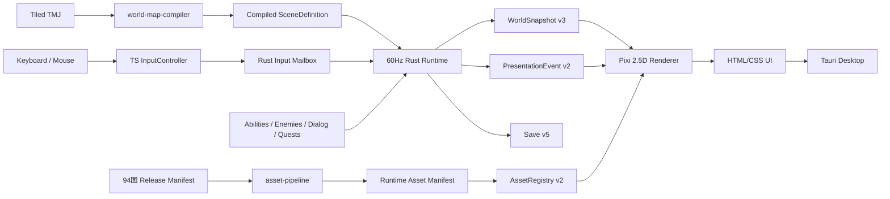
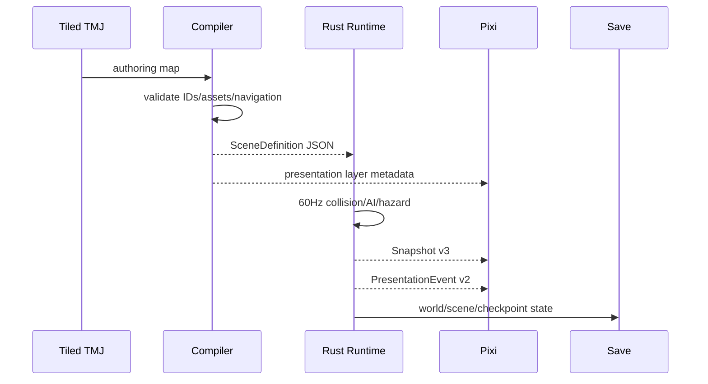
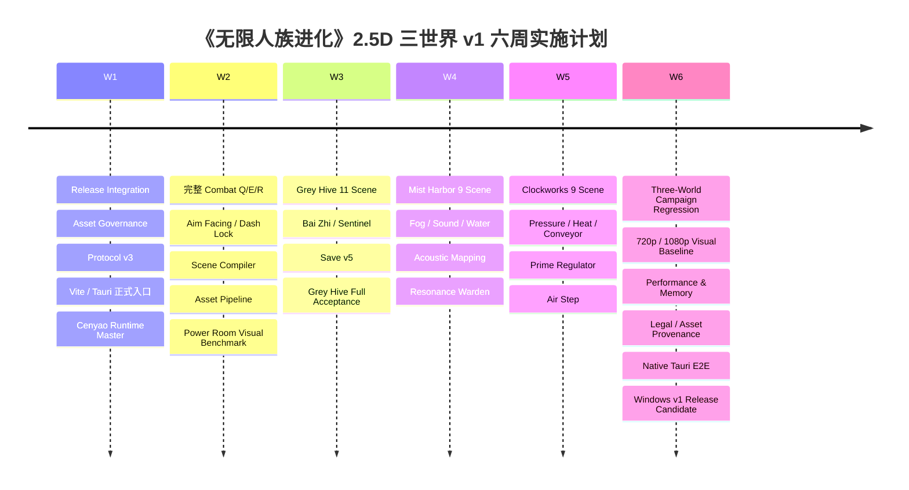

# 《无限人族进化》三世界 2.5D 首发 v1 完整实施与发布方案

## Executive Summary

截至 **2026-09-25**，应把 `codex/2d5-integration-02-2026-09-25 @ 4ff9d969dea8b034c3d3eb787c69d734394ca62d` 视为当前首发代码基线，而不是 `main @ 030eb9bf...`：integration 已整合 Rust 独立 60 Hz simulation owner、Scenario Runner、Presentation Harness、`WorldSnapshot v2`、稳定 `entityType`、Presentation Events、Save schema v4 与 TypeScript/Pixi 2.5D foundation；`main` 的最新提交主要是素材/工具上传。fileciteturn38file0L2-L2 fileciteturn39file0L2-L2 fileciteturn13file0L2-L2

但当前代码仍只是“**2.5D 引擎骨架 + Grey Hive 第一段可验证流程**”：`FormalRuntime` 仍硬编码 Grey Hive、Power Console 和 Gate A；Q/E/R/Context Traversal 尚未实现；鼠标 aim 已传入 Rust，却没有成为战斗 facing；`WorldRenderer` 仍是单层 sprite renderer；`AssetRegistry` 只有 texture/anchor/scale；Tauri 仍指向旧 `release-ui`，且 bundling 关闭。fileciteturn36file0L2-L2 fileciteturn37file0L2-L2 fileciteturn22file0L2-L2 fileciteturn25file0L2-L2 fileciteturn34file0L2-L2

首发不应再把 Grey Hive、Mist Harbor、Clockworks 做成三张“Demo”，而应形成一个完整 campaign：**Return Station → Grey Hive → 能力选择 → Mist Harbor → 能力扩展 → Clockworks → v1 结尾/有限复访**。当前 `world_progression_v1.json` 已经把三个世界、顺序、首通事件和复访政策定义出来，因此最合理的迁移不是重写产品结构，而是把现有 Rust progression 从“有世界名、没有世界内容”升级为真正的多 Scene Runtime。fileciteturn42file0L2-L2

94 张图片继续采用已完成的集中审核结论：**43 `release_approved` / 30 `concept_only` / 21 `reject`**。其中 Grey Hive 基础资产最成熟；Mist Harbor 已有雾、水边、Drowned、Signal Wraith；Clockworks 已有工厂地板、压力管、炉体和 Forged Guard。但绝大多数正式 Hero Scene、完整动作集、Boss、UI、音频仍需生产。该台账应首先提交到 Git 并由 SHA gate 强制执行。fileciteturn33file0

**产品经理结论：**近期代码主线锁定为 **Release Integration → Asset Governance → Tauri/Pixi 正式入口 → Protocol/Combat → Scene Compiler → Grey Hive Full → Return Station Loop → Mist Harbor Full → Clockworks Full → Save v5 → Native Release QA → Windows v1**。不再恢复 Babylon/GLB/TPS 正式运行栈，也不扩第四世界。

## 当前代码基线与目标架构

当前 integration 分支最新提交是 `4ff9d969...`，提交时间晚于最新 `main@030eb9bf...`；integration 报告明确说明它是从 ENGINE 分支出发、选择性整合 Scenario Runner 与 Presentation Harness，而不是整体 merge 最新 main，并把 Babylon/GLB/TPS 历史内容归为 ARCHIVE/REJECT 路线。fileciteturn38file0L2-L2 fileciteturn13file0L2-L2

现有 Route 层其实已经为“三世界首发”留好了正确骨架：

| 当前能力 | 当前状态 | v1 处理 |
|---|---|---|
| `grey_hive` | 已注册、当前唯一实际 runtime | 扩为完整 11 Scene 世界 |
| `mist_harbor` | 已注册 progression，无 runtime scene | 实现 9 Scene |
| `clockworks` | 已注册 progression，无 runtime scene | 实现 9 Scene |
| 世界顺序 | GH → MH → CW | 保留 |
| Grey Hive required events | `hive_power / hive_lockdown / hive_extraction` | 场景事件与其对齐 |
| Mist Harbor required events | `mist_beacon_west / mist_beacon_east / mist_signal` | 场景事件与其对齐 |
| Clockworks required events | `clockworks_valves / clockworks_core / clockworks_shutdown` | 场景事件与其对齐 |
| Grey Hive/MH 复访 | 首通后最多 2 次 | v1 保留 |
| Clockworks 复访 | task candidate limited，最多 4 次 | v1 保留 |

这些都已经存在于 `world_progression.rs` 和数据文件中，不应被新 Scene 系统重写。fileciteturn41file0L2-L2 fileciteturn42file0L2-L2

当前能力层也已有四个 canonical capability：

```text
information.local_map_i
perception.rear_view_i
information.enemy_vitals_basic
body.regeneration_i
```

其中 regeneration 已数据化为受伤后 1500 ms、战斗后 3000 ms 才开始，2.5 HP/s、恢复上限 75%；这些数值文件自己注明为 development defaults，可以继续调，不应改成 TS 常量。fileciteturn43file0L2-L2

目标正式架构应冻结为：



其中最重要的边界是：**Rust 决定游戏事实，Pixi 决定它长什么样。** 当前代码已经基本遵守这一方向：浏览器提交 input mailbox，Rust 60 Hz owner 推进 simulation；renderer 不应修改 HP、碰撞或 route。fileciteturn12file0L2-L2 fileciteturn25file0L2-L2

现有 `WorldSnapshot` 虽为 protocol v2，但 Rust 的 `WorldView` 已经比 TS interface 多 `capabilities` 与 `progression` 字段；这是一个需要在 v3 时彻底同步的类型漂移。fileciteturn23file0L2-L2 fileciteturn30file0L2-L2

当前 save 也有一个需要顺手清理的命名债务：代码文件仍叫 `save_v3.rs`、类型叫 `SaveV3`、文件名为 `formal-save-v3.json`，但 `SAVE_SCHEMA_VERSION` 实际已经是 **4**；而且验证仍强制 `world_id == grey_hive`。因此三世界首发必须做真正的 Save v5，而不是继续给这个类型打补丁。fileciteturn44file0L2-L2

**正式 Git 策略：**

```text
release/v1-three-worlds-2d5
└── base = codex/2d5-integration-02-2026-09-25
           4ff9d969dea8b034c3d3eb787c69d734394ca62d
```

不要再重复 merge engine/scenario/presentation 分支，因为 integration 已包含它们。最新 main 只选择性迁入经确认需要的 94 图源文件和工具；不要 whole-tree merge，避免旧 3D/GLB/renderer 再回到 runtime。integration 报告本身也把 whole-tree merge main visual legacy 明确列为拒绝路线。fileciteturn13file0L2-L2

建议迁移操作：

```bash
git switch codex/2d5-integration-02-2026-09-25
git switch -c release/v1-three-worlds-2d5

# 精确的 94 图仓库前缀目前未在本会话冻结。
# 先用 git ls-tree 确认，然后按目录接收，不 merge main。
git ls-tree -r main --name-only | grep -E 'batch0[1-9]|batch10'

# 示例；实际 prefix 以 ls-tree 结果为准
git checkout main -- <confirmed-94-image-source-directory>
```

**回滚策略**统一采用“小提交可逆”：

| 改造 | 回滚点 |
|---|---|
| Tauri 新入口 | 独立 commit；失败直接 revert，旧 `release-ui` 在 Gate 通过前不删除 |
| Protocol v3 | v2 serializer/deserializer 保留一个迁移周期，仅测试使用 |
| Save v5 | 写 v5 前先备份旧 save；只读迁移 v4，不原地破坏 |
| Scene compiler | TMJ 始终作为 source-of-truth，compiled JSON 可重建 |
| Asset pipeline | source PNG 不修改；runtime 输出全为 generated |
| Asset Registry v2 | schemaVersion 强校验，可回退旧 registry test fixture |
| 三世界 content | 每个 world 独立 commit/feature flag，不允许一次巨型 merge |

当前 `governance/assets/` 已有 `inventory.json`、`provenance.schema.json`、`public-release-manifest.json`，但 public manifest 当前 `assets` 是空数组，旧资产多数列在 exclusions/pending review；因此 **94 图内部 `release_approved` 不能直接等同于 public-release legal gate**。最终发布还必须让 runtime 输出具有可追踪 provenance，并进入正式 public release manifest。fileciteturn45file0L2-L2 fileciteturn46file0L2-L2

## 工程、协议、资产与场景管线改造

当前 `FormalRuntime::initial_state()` 硬编码创建 `"grey_hive"`，`interact()` 只认 `gh_power_console`，并把 Power Console/Gate A 坐标写在源码常量里；这正是三世界化最先必须消除的硬编码。fileciteturn36file0L2-L2 fileciteturn37file0L2-L2

**代码文件级变更总表：**

| 路径 | 具体修改 | 验收 |
|---|---|---|
| `server-rs/src/formal_runtime.rs` | 去掉 Grey Hive 坐标/单交互硬编码；加入 `WorldRegistry / SceneRuntime / SceneTransition` | 任意 Scene 可通过 content load |
| `server-rs/src/world_v3.rs` | Snapshot v3；加入 `sceneId`、facing、action state、interactable/hazard/objective projections | Rust/TS snapshot contract test |
| `server-rs/src/continuous_input.rs` | Input v2；aim normalize/deadzone；worldEpoch/request domain | NaN/out-of-range/stale 全拒绝 |
| `server-rs/src/continuous_combat.rs` | 通用 Action State Machine；Q/E/R、energy/cooldown/windup/recovery | deterministic combat unit tests |
| `server-rs/src/continuous_kcc.rs` | Dash 锁向、moving surface、water multiplier、Context Traversal | dash/水/输送带 replay |
| `server-rs/src/sentinel_ai.rs` | 保留 Sentinel 特化；接口接统一 AI sensor/attack profile | Sentinel 行为不回归 |
| `server-rs/src/world_progression.rs` | 保留当前三世界顺序；增加 scene/checkpoint/reward wiring | required events 与现有 catalog 一致 |
| `server-rs/data/world_progression_v1.json` | 不改既有 event ID；补 reward/capability metadata | 三世界 progression test |
| `server-rs/src/save_v3.rs` | 新建 `save_v5.rs` 后迁出；支持 world/scene/checkpoint/generic actors | v4→v5 + 3-world Continue |
| `server-rs/src/lib.rs` | 注册新 Tauri commands | invoke contract test |
| `apps/web/src/protocol/types.ts` | 与 Snapshot v3 同步 | TS fixture 与 Rust JSON byte/schema test |
| `apps/web/src/game/InputController.ts` | Guard start/end；action 带 epoch；鼠标 deadzone | input unit tests |
| `apps/web/src/assets/AssetRegistry.ts` | v2 typed registry | 非 approved runtime manifest 拒绝 |
| `apps/web/src/renderer/WorldRenderer.ts` | 拆层、camera、occlusion、actor animation、VFX | visual golden |
| `apps/web/src/bridge/tauri-client.ts` | 新 commands、错误类型、scene/dialog/save APIs | mocked + native Tauri test |
| `apps/web/package.json` | Vite build/dev；完整 `dist` | `npm run build` 产生静态包 |
| `server-rs/tauri.conf.json` | `frontendDist` 指 `../apps/web/dist`；bundle active；改产品名/窗口 | 安装包 smoke |
| `tools/asset-pipeline/` | 新增 | SHA/status/atlas reproducibility |
| `tools/world-map-compiler/` | 新增 | validate-all |
| `content/worlds/**` | 新增三世界/归航站 content | compiler 全绿 |
| `.github/workflows/ci.yml` | 新增统一 CI | PR 无绿灯不可合并 |

现有 Tauri 配置仍是旧产品名“无限轮回-生化蜂巢”，`frontendDist: "./release-ui"`，窗口高度 820，而且 `bundle.active=false`；正式首发必须一起改掉。fileciteturn34file0L2-L2 Tauri v2 官方配置允许把 web bundler 的 `dist` 目录设为 `frontendDist`，相对路径中的静态文件会被纳入应用；Windows 可构建 NSIS setup 或 MSI。citeturn0search0turn0search1turn0search11

建议：

```diff
 {
-  "productName": "无限轮回-生化蜂巢",
+  "productName": "无限人族进化",
   "version": "1.0.0",
-  "identifier": "com.gwl.wuxian-horror-ch1",
+  "identifier": "com.wuxian.humanevolution",
   "build": {
-    "frontendDist": "./release-ui"
+    "beforeBuildCommand": "npm --prefix ../apps/web run build",
+    "frontendDist": "../apps/web/dist"
   },
   "app": {
-    "withGlobalTauri": true,
     "windows": [{
-      "title": "无限轮回 · 第一章 生化蜂巢",
+      "title": "无限人族进化",
       "width": 1280,
-      "height": 820,
+      "height": 720,
       "minWidth": 1280,
-      "minHeight": 600
+      "minHeight": 720
     }]
   },
   "bundle": {
-    "active": false
+    "active": true,
+    "targets": ["nsis"]
   }
 }
```

`apps/web/package.json` 当前只有 `tsc` build，没有 Vite，这不足以产生正式 Tauri 静态入口。fileciteturn35file0L2-L2 建议改为：

```json
{
  "scripts": {
    "dev": "vite",
    "typecheck": "tsc --noEmit",
    "build": "tsc --noEmit && vite build",
    "test": "node --test tests/*.mjs",
    "test:visual": "playwright test"
  }
}
```

Tauri 官方当前 Vite 指南也采用 `devUrl + frontendDist + beforeBuildCommand` 这一模型。citeturn0search11

**Protocol v3 建议一次冻结，避免三世界开发中不断破 wire contract：**

```ts
export interface InputStateV2 {
  protocol: "continuous-input";
  protocolVersion: 2;
  worldEpoch: number;
  seq: number;
  clientTimeMs: number;
  moveX: number;
  moveZ: number;
  aimX: number;
  aimZ: number;
}

export type ActionKind =
  | "primaryAttack"
  | "dash"
  | "pulse"
  | "guardStart"
  | "guardEnd"
  | "pierce"
  | "interact"
  | "contextTraversal";

export interface ActionCommandV2 {
  protocolVersion: 2;
  worldEpoch: number;
  requestId: number;
  clientTimeMs: number;
  kind: ActionKind;
}

export interface PlayerViewV3 {
  entityId: string;
  transform: Transform;
  velocityMps: Vec3;
  facingX: number;
  facingZ: number;
  aimX: number;
  aimZ: number;
  actionState: string;
  currentHp: number;
  maxHp: number;
  currentEnergy: number;
  maxEnergy: number;
}

export interface WorldSnapshotV3 {
  kind: "full";
  protocolVersion: 3;
  worldId: string;
  sceneId: string;
  checkpointId: string | null;
  worldEpoch: number;
  serverTick: number;
  authorityRevision: number;
  ackSeq: number;
  player: PlayerViewV3;
  actors: ActorViewV3[];
  doors: DoorViewV3[];
  interactables: InteractableView[];
  hazards: HazardView[];
  objectives: ObjectiveView[];
  capabilities: CapabilityProjection;
  progression: RouteProjection;
}
```

当前 TS 已经发送 `aimX/aimZ`，Rust `InputSample` 也接受和验证它们；问题是 `WorldStateV3::view()` 的 player yaw 仍固定为 0，当前攻击逻辑也没有使用 aim。因此这不是重做输入，而是把已经存在的 aim 数据真正接到 authoritative facing/combat。fileciteturn24file0L2-L2 fileciteturn27file0L2-L2 fileciteturn30file0L2-L2

Rust 建议核心逻辑：

```rust
fn update_facing(player: &mut PlayerCombatState, input: &InputSample) {
    let aim_len2 = input.aim_x * input.aim_x + input.aim_z * input.aim_z;

    if !player.action_locks_facing && aim_len2 >= 0.04 {
        let len = aim_len2.sqrt();
        player.facing_x = input.aim_x / len;
        player.facing_z = input.aim_z / len;
    }
}

fn begin_dash(player: &mut PlayerCombatState, movement: Vec2) {
    player.dash_dir = if movement.length_squared() >= 0.04 {
        movement.normalized()
    } else {
        Vec2::new(player.facing_x, player.facing_z)
    };

    // dash 生命周期中禁止后续 input 重写 dash_dir。
    player.action_locks_facing = true;
}
```

**Asset Registry v2** 必须在 Slot B 大批生产前冻结。当前 Registry 只有 `kind/textureUrl/anchorX/anchorY/scale`，无法表达 atlas、方向、动画、门状态、来源 SHA 或 VFX。fileciteturn22file0L2-L2

```ts
type Direction = "n" | "ne" | "e" | "se" | "s" | "sw" | "w" | "nw";

interface RuntimeAssetBase {
  schemaVersion: 2;
  assetId: string;
  sourceAssetId: string;
  releaseSha256: string;
  atlas: string;
  atlasData: string;
}

interface AnimationDef {
  frames: string[];
  fps: number;
  loop: boolean;
}

interface ActorAsset extends RuntimeAssetBase {
  kind: "actor";
  anchor: [number, number];       // 必须是脚底中心语义
  scale: number;
  sortBias: number;
  directions: 4 | 8;
  mirrorAllowed: boolean;
  animations: Record<string, Partial<Record<Direction, AnimationDef>>>;
  shadow: {
    kind: "ellipse";
    widthM: number;
    heightM: number;
    opacity: number;
  };
}

interface PropAsset extends RuntimeAssetBase {
  kind: "prop";
  states: Record<string, string>;
  anchor: [number, number];
  sortBias: number;
}

interface DoorAsset extends RuntimeAssetBase {
  kind: "door";
  states: {
    closed: AnimationDef;
    opening: AnimationDef;
    open: AnimationDef;
    closing?: AnimationDef;
    locked?: AnimationDef;
  };
  collisionProfile: string;
}

interface VfxAsset extends RuntimeAssetBase {
  kind: "vfx";
  frames: string[];
  fps: number;
  loop: boolean;
  blendMode: "normal" | "add" | "screen";
  lifetimeMs: number;
  anchor: [number, number];
}
```

PixiJS 8 自身已支持 promise/cached asset loading、WebP/PNG 和 spritesheet JSON，因此正式管线应生成 asset bundles/atlases，而不是在 `WorldRenderer.place()` 中首次见到实体时再零散加载单 PNG。citeturn0search4

**Asset Pipeline：**

```text
94图 source
  ↓
查 AI_ASSET_RELEASE_MANIFEST
  ↓
SHA-256 必须匹配
  ↓
release_status == release_approved
  ↓
alpha / crop / edge cleanup
  ↓
统一 feet anchor / canvas / scale
  ↓
拆件 / 动画 / atlas
  ↓
RUNTIME_ASSET_MANIFEST
  ↓
AssetRegistry v2
```

`concept_only` 和 `reject` 均必须 **hard fail**，而不是 warning。

Runtime manifest：

```json
{
  "runtimeAssetId": "actor.cenyao.runtime.v1",
  "kind": "actor",
  "sourceAssetId": "runtime2d.actor.cenyao.base.v1",
  "sourceSha256": "1915e77897a4facea0bfee4c529daf5cd4961998fe4887efc4a340f253424801",
  "outputSha256": "<generated>",
  "releaseStatus": "release_approved",
  "toolVersion": "asset-pipeline/1",
  "anchor": [0.5, 0.94],
  "atlas": "actors/cenyao/atlas.webp"
}
```

建议正式规格：

| 类型 | 单图/atlas | Alpha | Packing |
|---|---|---|---|
| Actor 普通 | 原始 frame ≤ 1024×1024；atlas ≤ 4096² | 必须 | 4 px padding + 2 px extrusion |
| Boss | frame ≤ 1536²；Boss 独立 atlas ≤4096² | 必须 | 禁止和世界 texture 混打 |
| Props | 单项 ≤1024²；世界 props atlas ≤4096² | 按需 | static/animated 分页 |
| VFX | frame ≤1024²；atlas ≤4096² | 必须 | additive VFX 单独页 |
| UI icon | 64/128/256 master；atlas ≤2048² | 必须 | pixel-snapped |
| Hero Scene layer | 单层最长边 ≤4096 | 按层 | 超过则按 chunk 切，不产 8K 单图 |

这些是本项目 **release budget**，不是 PixiJS 的技术上限。

**SceneDefinition 与 TMJ compiler：**Tiled 的 JSON/TMJ 格式支持 object layers、properties、自定义 class/property，因此适合做 authoring format；运行时不应直接信任 TMJ，而应由 compiler 转成 canonical JSON。citeturn0search10turn0search15

建议 Tiled 层固定为：

```text
visual.background
visual.floor
visual.floor_detail
visual.props_back
visual.props_dynamic
visual.foreground
visual.occluders
visual.vfx_markers

logic.collision
logic.navigation
logic.spawn
logic.interaction
logic.door
logic.trigger
logic.hazard
logic.checkpoint
logic.camera
logic.objective
logic.transition
```

Canonical Scene：

```json
{
  "schemaVersion": 1,
  "worldId": "mist_harbor",
  "sceneId": "mh_drowned_quay",
  "boundsM": { "x": 0, "z": 0, "width": 96, "depth": 64 },

  "presentation": {
    "cameraProfile": "oblique_default",
    "backgroundAsset": "scene.mh.drowned_quay.background",
    "layers": [
      { "id": "floor", "zGroup": 10 },
      { "id": "actors", "zGroup": 30 },
      { "id": "foreground", "zGroup": 50 }
    ]
  },

  "collision": [
    {
      "id": "wall_001",
      "polygon": [[0,0],[5,0],[5,2],[0,2]]
    }
  ],

  "occluders": [
    {
      "id": "warehouse_roof_01",
      "polygon": [[20,10],[32,10],[32,25],[20,25]],
      "fadeTo": 0.25
    }
  ],

  "spawns": [
    {
      "id": "spawn_entry",
      "kind": "player",
      "position": [4,0,8]
    }
  ],

  "actors": [
    {
      "id": "drowned_01",
      "entityType": "enemy.mist_harbor.drowned",
      "spawn": [34,0,22],
      "encounterId": "mh_dq_wave_a"
    }
  ],

  "interactions": [
    {
      "id": "pump_valve_01",
      "kind": "toggle",
      "rangeM": 1.8,
      "event": "mh_pump_open"
    }
  ],

  "hazards": [
    {
      "id": "deep_water_a",
      "kind": "water",
      "polygon": [[0,20],[40,20],[40,40],[0,40]],
      "moveMultiplier": 0.72
    }
  ],

  "vfxMarkers": [
    {
      "id": "fog_01",
      "vfx": "vfx.mh.fog_bank",
      "position": [18,0,18]
    }
  ],

  "transitions": [
    {
      "id": "to_breakwater",
      "toSceneId": "mh_breakwater",
      "spawnId": "spawn_from_quay"
    }
  ]
}
```

Compiler 必须阻止：

```text
duplicate worldId/sceneId/object id
unknown entityType
unknown assetId
asset release_status != release_approved
SHA mismatch
invalid polygon
zero-area collider
spawn outside bounds
missing player spawn
missing transition target
door with unknown destination
objective without completing trigger
unreachable mandatory checkpoint
required world event never emitted
encounter references unknown enemy
dialog references unknown speaker
occluder without valid polygon
atlas missing
```

Scene compiler 和 Rust runtime 的关系应是：



## 三世界完整场景、剧情与资源矩阵

历史 3D 规划已经把 Grey Hive 定义为首个正式世界，并要求 Hub、战斗、Q/E/R、Gate A/B、白芷、Sentinel、任务/地图/暂停/存档等完整游戏结构；后续连续世界规划将 Mist Harbor 定义为“雾、声音、信号”，Clockworks 定义为“机械、热、动态危险、复杂空间”。这里保留其**产品意图**，但彻底废弃历史 3D 表现实现。fileciteturn18file0L2-L2 fileciteturn17file0L2-L2

以下场景是本报告建议冻结为 v1 canonical content。Mist Harbor 与 Clockworks 的细分场景在当前代码中**尚未存在 SceneDefinition**，因此属于本次首发规格，不冒充当前实现。

性能 profile 是内部 release budget：

| Profile | 可见 sprite | draw calls P95 | resident texture | particles | atlas pages |
|---|---:|---:|---:|---:|---:|
| S | ≤300 | ≤55 | ≤160 MB | ≤200 | world 4 + actor 2 |
| M | ≤450 | ≤75 | ≤220 MB | ≤350 | world 6 + actor 3 |
| L | ≤600 | ≤90 | ≤280 MB | ≤450 | world 7 + actor 3 |
| Boss | ≤550 | ≤95 | ≤300 MB | ≤600 | world 7 + actor 4 |

目标为 Windows 1080p 默认设置稳定 60 FPS；720p 不允许更差。该预算是首发门槛，不是“Pixi 理论上最多多少”。

**Grey Hive / 灰巢设施 · B-17 回收层**

```text
GH Entry/Maintenance
 → Power Room
 → Gate A
 → Central Shaft
 → Lockdown
 → Bio Isolation / Bai Zhi
 → Gate B
 → Deep Decon
 → Sentinel Arena
 → Beacon
 → Exit
```

| Scene | Props / 交互 | 敌人/NPC | 对话/触发/UI | VFX / Audio | 94 图复用 | 缺失新资源 | Perf |
|---|---|---|---|---|---|---:|---|
| `gh_entry_maintenance` | airlock、wall/floor、pipes、crates、教程 terminal；F 检查门 | infected worker×2 | `gh_sys_arrival`:“B-17 链路仅保持最低功率。”；教程 WASD/LMB/F/Shift；进入触发 checkpoint | 冷凝雾、灯闪；`audio.gh.ambient.facility` | floor/wall/pipes、crates | 4：Hero plate、airlock、维修终端状态、入口灯层 | M |
| `gh_power_room` | Power Console off/on、breaker、管路；F 恢复主电 | worker×2 + security×1 | `gh_cy_power_01`:“主电还活着，只是被人为切断。”；完成 `hive_power`；Objective UI | power arc、off→on lighting；`power.start/on` | floor/wall/pipes、power_console、clutter | 2：Hero plate、lighting overlays | L |
| `gh_gate_a` | Gate A closed/open、门控面板 | security×2 | 未供电：“门控没有响应。”；供电后开门 | sparks/door steam；`gate.open` | Gate A | 1：Gate corridor plate | S |
| `gh_central_shaft` | 多层桥架、lift、护栏、吊缆、遮挡梁 | worker×3、security×2 | `gh_log_shaft_01` 设施撤离日志；首次大尺度 occlusion 教学 | shaft dust、远处灯；工业 hum | floor/wall/pipes；central_shaft 仅 concept 参考 | 5：Hero layers、lift、rail pack、occluder pack、shaft particles | L |
| `gh_lockdown` | lockdown terminal、障碍箱、bio door | worker×3、security×3、swarm×2 | Terminal 解封触发 `hive_lockdown`；`gh_sys_lockdown`：“隔离协议已被局部覆盖。” | 红警灯、alarm、hit debris | lockdown terminal、clutter、crates | 4：Hero plate、Swarm runtime、alarm beacon、battle decals | L |
| `gh_bio_isolation` | bio pod、medical station、sample case、日志 terminal | Bai Zhi + security×2 | `gh_bz_first_01`:“别开那扇门。先听我说。”；分支 `taken/left/unresolved`；不影响 Gate B | sterile fog、scanner；Bai Zhi voice optional | bio pod、medical station；Bai Zhi图仅 concept | 5：Hero plate、白芷 runtime、正式 portrait、sample case、scan VFX | M |
| `gh_gate_b` | Gate B、压缩通道、门控 | security×2、brute×1 | 若 `hive_lockdown` 未完成锁定；白芷选择不做钥匙 | pressure release | Gate B | 3：corridor plate、Brute runtime、Gate B animation cleanup | M |
| `gh_deep_decon` | spray nozzles、排水沟、safety alcove、valves | worker×2、swarm×2 | 去污周期触发 hazard；UI 只显示 hazard warning | decon mist、steam jets | floor/wall/pipes；旧 attempt 仅 concept/reject | 5：Hero plate、nozzle pack、valve states、decon VFX、hazard decal | L |
| `gh_sentinel_arena` | arena shutters、service pylons | Sentinel | `gh_sys_sentinel_01`:“自动防卫单元已接管本区。”；Boss bar；首次 kill state | heavy telegraph、impact、shake | Sentinel base/parts、approved arena candidate | 4：正式 arena 分层、telegraph、hit/stagger、death FX | Boss |
| `gh_beacon` | Beacon folded → deployed、storage mount | 可选 security wave | `gh_cy_beacon_01`:“这就是信号源。带回去，也许能解释这里为什么还在呼叫。” | deploy beam、scan ring | Beacon folded/deployed | 2：Beacon room plate、beam VFX | M |
| `gh_exit` | extraction console、sealed exit | 最后一波 worker/security | 部署/携带 Beacon 后触发 `hive_extraction`；world complete | extraction light、fade | clutter；旧 exit 仅 concept | 3：Exit plate、exit machinery、world-complete VFX | M |

Grey Hive 当前已有 `hive_power/hive_lockdown/hive_extraction` 三个 required event，因此上述关键 Scene 可以不修改 canonical progression ID。fileciteturn42file0L2-L2

**Mist Harbor / 雾港余烬**

核心不是“换蓝色场景”，而是让玩家意识到**视觉不是可靠信息源**。新能力建议：

```text
perception.acoustic_mapping_i
```

它不替代 accessibility，不把字幕、声音可视化辅助功能锁在能力树里；它只增加 gameplay 信息。

```text
Fog Pier
 → Tidal Warehouse [West Beacon]
 → Signal Yard
 → Drowned Quay
 → Breakwater [East Beacon]
 → Pump Station
 → Resonance Tower [Signal]
 → Resonance Warden
 → Extraction
```

| Scene | Props / 交互 | 敌人/NPC | 对话/触发/UI | VFX / Audio | 94 图复用 | 缺失 | Perf |
|---|---|---|---|---|---|---:|---|
| `mh_fog_pier` | stone edge、灯桩、系缆柱、world entry beacon | Drowned×2 | `mh_sys_entry`:“视觉链路衰减。远端目标无法确认。”；引导声源方向 | fog bank、水波、foghorn | fog/fog_bank、water_edge/stone、Drowned | 4：Hero plate、pier props、lamp kit、splash | L |
| `mh_tidal_warehouse` | crates、winch、warehouse door、West Beacon | Drowned×3、Wraith×1 | 激活 `mist_beacon_west`；日志：“西侧导航灯在断网后仍被人工维护。” | dripping、metal echo | fog/water、Drowned/Wraith；旧 props pack concept | 5：Hero plate、warehouse pack、beacon、door、echo FX | M |
| `mh_signal_yard` | antenna、broken relay、cable trenches | Wraith×3 | 信号干扰令 objective 从精确点退化为区域；`mh_cy_signal_01`:“不是没信号，是有人在用噪声盖住它。” | distortion、static | fog、Wraith | 5：Hero plate、antenna kit、relay、distortion VFX、signal UI | L |
| `mh_drowned_quay` | submerged path、boat remains、bollards | Drowned×4、Tidebound×1 | water depth 首次影响速度；无强制对话 | splashes、underwater rumble | water edge、Drowned | 5：Hero plate、Tidebound、boat props、water hazard layers、wet decals | L |
| `mh_breakwater` | seawall、East Beacon、wind shelter | Wraith×2、Tidebound×2 | 激活 `mist_beacon_east`；`mh_sys_beacon_sync`：“双基准建立，中心干扰源可定位。” | heavy fog、wave spray、wind | fog/water、Drowned/Wraith | 5：Hero plate、breakwater pack、beacon、wave FX、wind debris | L |
| `mh_pump_station` | pumps、sluice gates、valves | Drowned×3 | 开泵降低后续水位；可选 shortcut | pump surge、water drain | machinery 仅 concept；water approved | 5：Hero plate、pump kit、sluice door、valve states、drain FX | M |
| `mh_resonance_tower` | resonance coils、signal console、stairs | Wraith×4、Tidebound×1 | 完成 `mist_signal`；授予/启用 Acoustic Mapping；`mh_cy_map_01`:“这次我不是在看路——是在听。” | echo scan、signal pulse | fog/Wraith | 6：Hero plate、tower kit、console、echo-scan VFX、capability icon、audio pulse | L |
| `mh_warden_arena` | acoustic pylons、flooded arena | Resonance Warden | Boss bar；Boss call 可被 Acoustic Mapping 定位 | shockwave、fog displacement | fog/water | 5：Boss actor/anim、arena、shockwave、boss death FX、boss SFX | Boss |
| `mh_extraction` | harbor uplink、exit skiff/portal | 无必须战斗 | World complete；Return Station 解锁 MH 复访 | fog clears briefly | water/fog | 3：exit plate、uplink、completion VFX | M |

这些主线事件直接对应当前 Rust catalog 的 `mist_beacon_west / mist_beacon_east / mist_signal`，避免为新 Scene 系统重新发明 progression semantics。fileciteturn42file0L2-L2

**Clockworks / 钟骨工厂**

视觉冻结为：

```text
steel / brass / furnace / steam / pressure / conveyor /
moving machinery / vertical factory
```

不是回到旧“天空钟城”或通用奇幻钟楼。

新能力建议：

```text
mobility.air_step_i
```

v1 只用于受控 traversal marker，不开放无限空中移动。

```text
Entry Foundry
 → Pressure Hall [Valves]
 → Conveyor Bridge
 → Boiler Chamber
 → Gear Shaft
 → Furnace Heart
 → Forged Guard Arena
 → Regulator Core [Core]
 → Shutdown Exit [Shutdown]
```

| Scene | Props / 交互 | 敌人/NPC | 对话/触发/UI | VFX / Audio | 94 图复用 | 缺失 | Perf |
|---|---|---|---|---|---|---:|---|
| `cw_entry_foundry` | steel floor、forge tables、chains | Forged Guard×2 | `cw_sys_entry`:“生产线无人值守，但压力循环仍在运行。” | sparks、steam | factory tiles/floor、Forged Guard、furnace | 4：Hero plate、wall pack、chain kit、spark FX | L |
| `cw_pressure_hall` | pressure pipes、3 valves、gauges | Guard×2、Pressure Drone×2 | 三阀完成 `clockworks_valves`；Pressure UI | steam burst | pressure pipes/valve | 5：Hero plate、Drone、gauge pack、steam VFX、pressure UI icon | L |
| `cw_conveyor_bridge` | conveyor、guard rails、crane hook | Guard×3、Drone×2 | moving surface 教学；Space context vault | belt dust、metal clank | factory floor | 5：Hero plate、conveyor kit、rail pack、crane props、movement FX | L |
| `cw_boiler_chamber` | boiler、vents、coolant valve | Furnace Hound×3 | Heat 首次持续积累；coolant 可暂时降热 | heat shimmer、steam | furnace、pipes | 5：Hero plate、Hound、boiler kit、heat VFX、coolant VFX | L |
| `cw_gear_shaft` | lift、gear walls、moving platforms | Drone×3、Guard×2 | vertical traversal；checkpoint | gear dust、chain noise | factory floor | 5：Hero layers、moving platform、gear kit、lift、occluders | L |
| `cw_furnace_heart` | furnace core、molten channels、cooling switches | Hound×3、Guard×2 | `cw_cy_heat_01`:“炉心不是失控——它被维持在过载边缘。” | molten sparks、heat | furnace v1/v2 | 4：Hero plate、molten channel、cooling switch、heat/spark pack | L |
| `cw_forged_guard_arena` | forge presses、arena shutters | Forged Guard elite | miniboss；首次强 pressure wave | impact sparks | Forged Guard | 4：arena、elite animation set、press machinery、impact VFX | Boss |
| `cw_regulator_core` | regulator pylons、core console | Prime Regulator | 完成 `clockworks_core`；Boss 多阶段阀门/炉心联动 | pressure wave、core flare | floor/pipes/furnace | 6：Boss、arena、core machine、wave FX、death FX、boss audio | Boss |
| `cw_shutdown_exit` | master shutdown、Air-Step marker、exit | optional Drone wave | `clockworks_shutdown`；解锁 Air Step；`cw_cy_end_01`:“原来门一直不止三扇。” | shutdown blackout→emergency | factory kit | 4：Exit plate、master console、Air-Step VFX/icon、epilogue overlay | M |

Clockworks 三个 required event 已在当前 catalog 固定为 `clockworks_valves / clockworks_core / clockworks_shutdown`，上述设计同样直接复用。fileciteturn42file0L2-L2

**Return Station / 归航站虽然不计“三个世界”，但它是 v1 必需运行场景**：

```text
Core Room
World Gate
Mission Terminal
Capability Terminal
Save / Rest Terminal
Storage / Inventory
```

归航站应只做一间高完成度工业安全空间，不做大型地图。现有 approved `returnstation.terminals` / `terminal` 可生产为终端道具；原 Return Station 整体图是 concept_only，而第九批 Core Room/World Gate/Capability Terminal attempts 都是 reject，所以正式 Hero Room 与 World Gate 必须新做。fileciteturn33file0

关键 Hub 对话：

| Node | 触发 | 正文/功能 |
|---|---|---|
| `rs_intro` | New Journey | “归航链路稳定。请选择首次回收坐标：灰巢设施。” |
| `rs_after_gh` | GH 首通 | “灰巢信标已解析。检测到第二组低可信坐标：雾港余烬。” |
| `rs_first_evolution` | GH 首通 | 从 Local Map / Rear View / Regeneration 中做首次明确进化选择 |
| `rs_after_mh` | MH 首通 | “声学映射已固化。第三坐标的机械周期与信号高度同步。” |
| `rs_after_cw` | CW 首通 | “三处坐标不是孤立事件。网络中仍存在未识别节点。” |
| `rs_v1_epilogue` | 全三世界完成 | World Network 展示三个已完成节点与多个未知节点 |

## 角色、战斗、UI、音频与完整资源台账

**角色动画生产原则：**首发不建议给每个角色生成数百张独立 AI raster frame。岑遥、白芷及普通敌人优先采用 **方向 master + cutout rig + 战斗关键 pose/短帧 + VFX**；Boss 才投入更高关键帧预算。岑遥有非对称肩甲，所以不能把东向直接镜像成西向。

| 角色 | 方向 | 必须动作 | 建议规格 |
|---|---:|---|---|
| 岑遥 | 8 | idle/walk/run/primary/dash/pulse/guard/pierce/hit/death/interact/traversal | Idle 6；Walk 8；Run 8；Primary 10；Dash 6；Pulse 10；Guard 4+hold+4；Pierce 10；Hit 4；Death 12；Traversal 8；cutout rig |
| 白芷 | 4 | idle/walk/talk/hurt(optional) | Idle 4；Walk 6；Talk 4；不需要完整战斗 |
| Infected Worker | 4 | idle/walk/attack/hit/death | 4/6/8/4/10 |
| Infected Security | 4 | idle/walk/attack/block/hit/death | 4/6/8/6/4/10 |
| Swarm | 方向弱化 | idle/swarm/lunge/hit/disperse | 6/8/6/4/8 |
| Brute | 4 | idle/walk/charge/slam/hit/death | 4/6/8/10/4/12 |
| Sentinel | 8 | idle/walk/light/heavy/telegraph/stagger/hit/death | 6/8/10/12/6/8/6/14 |
| Drowned | 4 | idle/walk/grab/hit/death | 4/6/8/4/10 |
| Signal Wraith | 4 | hover/move/cast/blink/hit/dissolve | 6/6/10/6/4/10 |
| Tidebound | 4 | idle/walk/swing/charge/hit/death | 4/6/10/8/4/12 |
| Resonance Warden | 8 | idle/move/call/wave/slam/stagger/death | 6/8/12/12/12/8/16 |
| Forged Guard | 4 | idle/walk/swing/guard/hit/death | 4/6/10/6/4/12 |
| Pressure Drone | 4 | hover/move/burst/hit/death | 6/6/8/4/8 |
| Furnace Hound | 4 | idle/run/bite/leap/hit/death | 4/8/8/10/4/12 |
| Prime Regulator | 8 | idle/walk/wave/vent/core/slam/stagger/death | 6/8/12/10/12/12/8/18 |

2D 不需要传统 3D mesh LOD。建议只做 **LOD0 正式 atlas + 可选 low-quality texture tier**：低设置把环境 texture 采样到 0.5–0.75 倍，而不是切换角色设计；offscreen actor 在屏幕外 1.25 viewport 后不 render，Rust simulation 仍正常。

**首发战斗初始数据**为本方案调优基线，不是当前仓库已有数值：

| Action | Energy | CD | Windup | Active | Recovery | Range | Damage | Stagger |
|---|---:|---:|---:|---:|---:|---:|---:|---:|
| Primary | 0 | 220 ms | 90 | 90 | 150 | 1.7 m | 16 | 10 |
| Dash | 8 | 900 ms | 0 | 180 | 120 | ≈2.8 m | 0 | 0 |
| Pulse Q | 12 | 2200 ms | 220 | 120 | 250 | 2.6 m radial | 10 | 35 |
| Guard E | 15 | 1800 ms | 80 | 600 max | 200 | self | 0 | Guard impact 20 |
| Pierce R | 18 | 2600 ms | 260 | 160 | 360 | 4.8 m line | 32 | 25 |
| Space Context | 0 | 350 ms context | context | context | context | 1.2 m marker | 0 | 0 |

当前 `ActionKind` 已声明 `primaryAttack/dash/pulse/guard/pierce/interact/contextTraversal`，但 Rust `submit_action()` 实际仅映射 PrimaryAttack 和 Dash，其他全部返回 `E_ACTION_NOT_IMPLEMENTED`。fileciteturn23file0L2-L2 fileciteturn37file0L2-L2

正式 Presentation Event v2：

```text
AttackStarted
AttackImpact
Hit
Damaged

DashStarted
DashTrail
DashEnded

PulseCast
PulseHit

GuardStarted
GuardImpact
GuardEnded

PierceStarted
PierceHit

EnemyAlert
EnemyAttackTelegraph
EnemyStagger
EnemyDeath

DoorStateChanged
InteractionStarted
InteractionCompleted

HazardActivated
HazardImpact

CheckpointReached
CapabilityUnlocked
WorldCompleted

AudioCue
CameraShake
```

建议 wire DTO：

```json
{
  "protocolVersion": 2,
  "eventId": 9912,
  "worldEpoch": 14,
  "serverTick": 8822,
  "kind": "PierceHit",
  "sourceEntityId": "player",
  "targetEntityIds": ["cw_guard_03"],
  "positionM": {"xM":21.4,"yM":0,"zM":12.8},
  "direction": {"x":0.72,"z":-0.69},
  "radiusM": 0.0,
  "intensity": 1.0,
  "presentationCue": "vfx.skill.pierce.hit",
  "audioCue": "audio.skill.pierce.hit"
}
```

当前事件系统已经具备 worldEpoch + eventId 的去重/补拉基础，应该扩 typed payload，而不是重新发明 event bus。fileciteturn12file0L2-L2

**UI/UX 组件冻结：**

| UI | 组件 | Rust/数据接口 |
|---|---|---|
| HUD | HP、Energy、Q/E/R、Dash、目标、F/Space prompt | Snapshot player/objective/interactable |
| Local Map | rooms/connections/objectives | `CapabilityProjection.explored_map` |
| Rear View | 后向 threat cue | capability projection + sensor events |
| Enemy Vitals | 生命状态而非精确数值起步 | enemy vital tier |
| Dialog | portrait、speaker、body、choice、continue | dialog graph |
| Inventory | slots、item details、equip/use | inventory projection |
| Capability | 已有/候选/选择/说明 | capability projection |
| Pause | Resume/Save/Settings/Main/Quit | Tauri + save commands |
| Save | 多槽、时间、世界、场景、checkpoint、corrupt state | Save v5 metadata |
| Mission | current objective / optional / completed | objective projection |
| World Network | 三世界 + unknown nodes | RouteProjection |
| Settings | audio/display/input/accessibility | local settings，不受能力限制 |

当前 Rust `WorldView` 已经包含 capabilities 和 progression，而且 explored map / enemy vital tier / rear-view authorization 都有结构，UI 应直接消费这些 projection，而不是在前端重新推断。fileciteturn29file0L2-L2 fileciteturn30file0L2-L2

Design Tokens：

```css
:root {
  --bg-deep: #0b1116;
  --panel: rgba(16, 28, 36, .94);
  --panel-soft: rgba(22, 39, 49, .82);
  --border: rgba(150, 190, 205, .28);

  --accent-info: #77d5dc;
  --accent-action: #d8ad55;
  --danger: #d7655c;

  --text-main: #e7eef1;
  --text-muted: #91a2aa;

  --space-1: 4px;
  --space-2: 8px;
  --space-3: 12px;
  --space-4: 16px;
  --radius: 6px;
}
```

推荐中文 UI 字体 **Source Han Sans / 思源黑体**，并将字体文件及 OFL-1.1 license 一并纳入 notices；Adobe 官方仓库当前提供 Pan-CJK Source Han Sans，其 license 文件明确是 SIL Open Font License 1.1。citeturn1search6turn1search2

分辨率要求：

```text
1280×720  = 首发硬最低：Hub / Pause / Dialog 全部无文档滚动
1920×1080 = 主视觉基线
2560×1440 = 兼容测试，不要求额外内容密度
```

1280×720 下任何 Hub 页面出现 browser/document scroll 都算 P0 defect；滚动只能发生在 Inventory/Log 这类明确设计的内部 scroll container。

**音频 Registry 最少应包含：**

```text
audio.ui.confirm
audio.ui.cancel
audio.ui.error
audio.ui.tab
audio.ui.save
audio.ui.capability_unlock

audio.player.footstep.metal
audio.player.footstep.stone
audio.player.footstep.wood
audio.player.footstep.water
audio.player.attack
audio.player.dash
audio.player.hit
audio.player.death

audio.skill.pulse.cast
audio.skill.pulse.hit
audio.skill.guard.start
audio.skill.guard.hit
audio.skill.pierce.cast
audio.skill.pierce.hit

audio.gh.ambient.facility
audio.gh.ambient.shaft
audio.gh.power.off
audio.gh.power.start
audio.gh.power.on
audio.gh.gate.open
audio.gh.decon
audio.gh.sentinel.alert
audio.gh.sentinel.heavy
audio.gh.beacon.deploy

audio.mh.ambient.harbor
audio.mh.wind
audio.mh.water
audio.mh.foghorn
audio.mh.signal_noise
audio.mh.drowned
audio.mh.wraith
audio.mh.tidebound
audio.mh.echo_scan
audio.mh.warden.call
audio.mh.warden.impact

audio.cw.ambient.factory
audio.cw.steam
audio.cw.valve
audio.cw.pressure_warning
audio.cw.pressure_burst
audio.cw.conveyor
audio.cw.furnace
audio.cw.guard
audio.cw.drone
audio.cw.hound
audio.cw.regulator

bgm.return_station
bgm.grey_hive
bgm.grey_hive_boss
bgm.mist_harbor
bgm.mist_harbor_boss
bgm.clockworks
bgm.clockworks_boss
bgm.v1_epilogue
```

按事件和材质变体估算，最终应准备 **约 80–110 个 audio clips**；语音不是首发推进条件，所有关键信息必须有文本。白芷关键对话可配音，其余日志优先文字。

**新增正式美术清单。** 数量按“可独立验收的 asset family”计，不按 animation frame 计：

| P | 资源 family | 数量 | 规格 |
|---|---|---:|---|
| P0 | 岑遥 Runtime Master + Rig | 1 | 8向、脚底 anchor、cutout parts |
| P0 | 岑遥完整 animset | 1 | 上表全部动作 |
| P0 | 白芷 Runtime + portrait | 2 | 4向 NPC + 1024 portrait master |
| P0 | Grey Hive Hero Scene sets | 11 | background/floor/back/front/occluder/lighting |
| P0 | Swarm / Brute runtime | 2 | 4向或方向弱化 |
| P0 | Sentinel 补动画/VFX | 1 set | telegraph/stagger/death |
| P0 | Mist Harbor Hero Scene sets | 9 | 分层 Hero Scene |
| P0 | Tidebound | 1 | 4向完整敌人 |
| P0 | Resonance Warden | 1 | 8向 Boss |
| P0 | Clockworks Hero Scene sets | 9 | 分层 Hero Scene |
| P0 | Pressure Drone | 1 | 4向 |
| P0 | Furnace Hound | 1 | 4向 |
| P0 | Prime Regulator | 1 | 8向 Boss |
| P0 | Return Station Core Room | 1 | 小型 Hero Room |
| P0 | World Gate | 1 | off/charging/open |
| P0 | capability/skill core icons | 8–10 | 128 master |
| P0 | app icon + wordmark | 2 | 独立原创，不用 AI 随机文字 |
| P1 | GH prop supplement | 8–12 | sample case/decon/lift/rail etc. |
| P1 | MH prop pack | 18–24 | pier/boat/lamp/antenna/pump/beacon |
| P1 | CW machinery pack | 18–24 | conveyor/press/lift/gear/chain/core |
| P1 | 世界 VFX families | 24–32 | 12–20fps/透明 atlas |
| P1 | world icons / mission icons | 8–12 | SVG/PNG |
| P1 | 章节 key art | 4 | 三世界 + title |
| P1 | boss portrait/icon | 3 | UI |
| P2 | 额外 NPC variation | 4–6 | 非阻塞 |
| P2 | 复访专属 decals/props | 6–10 | post-clear polish |
| P2 | 预渲染章节视频 | 0–4 | 非阻塞；没有视频也必须完整 |

现有 94 图逐图准入表如下。它来自已经完成的集中审查，而不是本轮重新审图。fileciteturn33file0

| relative_path | asset_id | sha256 | release_status | suggested_use |
|---|---|---|---|---|
| `batch01/01_runtime2d.actor.cenyao.base.v1.png` | `runtime2d.actor.cenyao.base.v1` | `1915e77897a4facea0bfee4c529daf5cd4961998fe4887efc4a340f253424801` | release_approved | actor-source → 岑遥 runtime master |
| `batch01/02_runtime2d.actor.cenyao.parts.v1.png` | `runtime2d.actor.cenyao.parts.v1` | `5ec63d9e17743ab12ffc57144258fb1c46430643e3c00ec4338c89771bf28644` | release_approved | actor-parts → cutout rig |
| `batch01/03_runtime2d.grey_hive.floor_tiles.v1.png` | `runtime2d.grey_hive.floor_tiles.v1` | `ac36eb55fe0e5404b8b11ee6904d886703de6b5873d5b34be8c8f1008e5fc1e6` | release_approved | GH tiles runtime source |
| `batch01/04_runtime2d.grey_hive.wall_tiles.v1.png` | `runtime2d.grey_hive.wall_tiles.v1` | `a00aa90244b37b7b322d53b4323f77af380ff3bca869a40beed256ec76c2f94b` | release_approved | GH wall runtime source |
| `batch01/05_runtime2d.grey_hive.pipes_cables.v1.png` | `runtime2d.grey_hive.pipes_cables.v1` | `856ac9f64c56c58090d900fb406f0796cdccf7ac843cf2dfa7e1f7df5176b2ca` | release_approved | GH props runtime source |
| `batch01/06_runtime2d.prop.power_console.off_on.v1.png` | `runtime2d.prop.power_console.off_on.v1` | `4cc2443664940a54e776e4cfd8d682b8477a1848dc420b2df4990d8d398f9961` | release_approved | Power Console states |
| `batch01/07_runtime2d.prop.gate_a.closed_open.v1.png` | `runtime2d.prop.gate_a.closed_open.v1` | `7d4b352063775818773e3bbda6ae1296645e09a84f2a2940ae17075be8c00fed` | release_approved | Gate A states |
| `batch01/08_runtime2d.vfx.dash.v1.png` | `runtime2d.vfx.dash.v1` | `69ef29a1798b2ecc29ed38eeb1fafddbf25b151d75cd89b538f36b8412d0fe18` | release_approved | Dash VFX source |
| `batch01/09_runtime2d.vfx.pulse.v1.png` | `runtime2d.vfx.pulse.v1` | `f178a0477718b1cfa8f11454d9d0e7fa9272d773d21ec79be2cc313c5b7c06c2` | release_approved | Pulse VFX source |
| `batch01/10_runtime2d.vfx.guard_pierce.v1.png` | `runtime2d.vfx.guard_pierce.v1` | `6b850c7eedb5ecea14c196c8b0306fc6eb8fd9cdcb698a8efb51ee1c687b5d96` | release_approved | Guard/Pierce VFX source |
| `batch02/01_runtime2d.actor.baizhi.base.v1.png` | `runtime2d.actor.baizhi.base.v1` | `7caa3427314fc4f0b543ae0f3c3e7fbae915488096c946a34f7116602925ec16` | concept_only | 白芷造型 reference only |
| `batch02/02_runtime2d.actor.baizhi.parts.v1.png` | `runtime2d.actor.baizhi.parts.v1` | `48277fed2e05c6a4766e389f8d8beaa5b76aace21c66c2d10d60d2cb429b4d4a` | concept_only | 白芷 parts reference |
| `batch02/03_runtime2d.enemy.infected_maintenance_worker.v1.png` | `runtime2d.enemy.infected_maintenance_worker.v1` | `6b7055df24acfa58edfdf0342c67efb60f9fac892c80110d449700bf7021477d` | release_approved | GH enemy runtime source |
| `batch02/04_runtime2d.enemy.infected_security.v1.png` | `runtime2d.enemy.infected_security.v1` | `7bd9d4cf19f36d189cdf81530c3dee48450179696a7dbceb24eaf375714de4e4` | release_approved | GH enemy runtime source |
| `batch02/05_runtime2d.enemy.sentinel.base.v1.png` | `runtime2d.enemy.sentinel.base.v1` | `f7ced75a0fcf35afacf796f23630a40c309682c86ef67af79de5414a8a16fbe2` | release_approved | Sentinel master |
| `batch02/06_runtime2d.enemy.sentinel.parts.v1.png` | `runtime2d.enemy.sentinel.parts.v1` | `18014ec4dfd953d4054bd11df74b416bd2f9f6252b7732396edba406f4044b05` | release_approved | Sentinel rig parts |
| `batch02/07_runtime2d.prop.gate_b.v1.png` | `runtime2d.prop.gate_b.v1` | `433a56c7960d19e09fb77ea55aa1787197e4a2eecc12face0ab29d5eaac39450` | release_approved | Gate B source |
| `batch02/08_runtime2d.prop.beacon.folded.v1.png` | `runtime2d.prop.beacon.folded.v1` | `335b4658d533d501b8758070742ca3a7fff8ca30acbfa69703ec1519265c79d1` | release_approved | Beacon folded |
| `batch02/09_runtime2d.prop.beacon.deployed.v1.png` | `runtime2d.prop.beacon.deployed.v1` | `1bb59407d43b218a56f04ba5b0451844e0328549e8f448c48975aae165b36e6b` | release_approved | Beacon deployed |
| `batch02/10_runtime2d.prop.lockdown_terminal.v1.png` | `runtime2d.prop.lockdown_terminal.v1` | `ee6bed917621ddbb85edbd0a915bae07ede776917590b18c759ce3511299460d` | release_approved | Lockdown terminal |
| `batch03/01_runtime2d.prop.bio_pod.v1.png` | `runtime2d.prop.bio_pod.v1` | `aed2f8398fb30710b84b2b6e449ec46ddfe1f23c65b05cbc32de8fa3f7ff05a5` | release_approved | GH bio prop |
| `batch03/02_runtime2d.prop.supply_crates.v1.png` | `runtime2d.prop.supply_crates.v1` | `e8250132f14a9c621fd819c9b188a7a1d100e20b4da010966b45d987d51eac68` | release_approved | shared industrial props |
| `batch03/03_runtime2d.prop.medical_station.v1.png` | `runtime2d.prop.medical_station.v1` | `57e58fe63b903d2a39c5ddb689c663c2fea47fc6488a21c452abe805a628e55e` | release_approved | medical prop |
| `batch03/04_runtime2d.grey_hive.clutter.v1.png` | `runtime2d.grey_hive.clutter.v1` | `d9b7f424d0ac278c9029d7ddc2ad9559f08a3c56562770eefc7ed301d9094a6c` | release_approved | GH clutter atlas |
| `batch03/05_runtime2d.world.grey_hive.central_shaft.v1.png` | `runtime2d.world.grey_hive.central_shaft.v1` | `0bd2ddb2011e4a8b2234549659537a2a7c02327eb452ece7c8d8bfe061addb7d` | concept_only | Central Shaft scene reference |
| `batch03/06_runtime2d.world.grey_hive.lockdown_zone.v1.png` | `runtime2d.world.grey_hive.lockdown_zone.v1` | `6f794e24effc1c8ad6071676b194abec09732507c11c858a3990fabde26bcc6f` | concept_only | Lockdown reference |
| `batch03/07_runtime2d.world.grey_hive.bio_isolation.v1.png` | `runtime2d.world.grey_hive.bio_isolation.v1` | `f43a3768c04dd62e144554b6ec4d3caa504d9d7e9f6cadb5a30acb3477b1e645` | concept_only | Bio Isolation reference |
| `batch03/08_runtime2d.world.grey_hive.sentinel_arena.v1.png` | `runtime2d.world.grey_hive.sentinel_arena.v1` | `1d7cfbea57f57171093d04148a0527d2b90a1467e9505e9a239d9539cddd1fff` | concept_only | arena composition reference |
| `batch03/09_portrait.cenyao.v1.png` | `portrait.cenyao.v1` | `13ebb98a6fb6414a7f9f928a1ec204c42108aa07cbdff4a5f60a39b8f49e69dc` | release_approved | Cenyao portrait |
| `batch03/10_portrait.baizhi.v1.png` | `portrait.baizhi.v1` | `f9401cf121ade25fe80f681dece698ac682abd45625daef7817db008197f4cac` | concept_only | Bai Zhi portrait reference |
| `batch04/01_batch04.original_collage_attempt.png` | `batch04.original_collage_attempt` | `a973e94e83c964ecb97a30cab608f9efc6e2b9c3c0ead9db031312c51f6bd437` | reject | none |
| `batch04/02_runtime2d.npc.engineer.v1.attempt.png` | `runtime2d.npc.engineer.v1.attempt` | `c6105aae74c380389cecfc348fb530719c381493bd810870bf155ad0f0e643aa` | concept_only | NPC reference |
| `batch04/03_runtime2d.npc.researcher.v1.attempt_a.png` | `runtime2d.npc.researcher.v1.attempt_a` | `b20dfe34318b0822519db08ccf9b0c3b094a57ca11ba0843841535b28619dc27` | reject | none |
| `batch04/04_runtime2d.npc.researcher.v1.attempt_b.png` | `runtime2d.npc.researcher.v1.attempt_b` | `9a0252b2a97b45723ff0cc7221bfcac8a89f3fe56b7602404e4bc7d72d8f2011` | concept_only | NPC reference |
| `batch04/05_runtime2d.enemy.swarm.v1.attempt.png` | `runtime2d.enemy.swarm.v1.attempt` | `e1963a31e67e8752d2eaa87f7f12d6ce8ffda0a70226d98776c61514ce64e95e` | reject | none |
| `batch04/06_runtime2d.enemy.brute.v1.attempt.png` | `runtime2d.enemy.brute.v1.attempt` | `042aa88ab1d8a917bc96126c4dbc137e8c8b7c9829427f24d62fcb75c1ab531a` | reject | none |
| `batch04/07_batch04.remaining_attempt.png` | `batch04.remaining_attempt` | `a2d2019b05610e5be72cc6096f2f0544a1144ad83278011fff296be15757a467` | reject | none |
| `batch04/08_batch04.maintenance_room_extra.png` | `batch04.maintenance_room_extra` | `2c7050df0b9edbb61c1ec4538b27ae78ff458e8bd7ad0ae05c9582e9d36ed29e` | concept_only | GH scene reference |
| `batch05/01_runtime2d.npc.engineer.v1.png` | `runtime2d.npc.engineer.v1` | `fc842ee8efa66246c43795b86190b77a9ffd89f7c8d4c712a2ba05bfacfd8a20` | concept_only | NPC reference |
| `batch05/02_runtime2d.npc.researcher.v1.png` | `runtime2d.npc.researcher.v1` | `2ba886401ff785c703ce84811d7579179d1f808c487545e7064b2d0c57820bb4` | concept_only | NPC reference |
| `batch05/03_runtime2d.enemy.swarm.v1.png` | `runtime2d.enemy.swarm.v1` | `a87484581ffaea3d150f13645f71396a041a7e0460621496ad6e6712cbd86538` | concept_only | Swarm design reference |
| `batch05/04_runtime2d.enemy.brute.v1.png` | `runtime2d.enemy.brute.v1` | `1de2c5160fe4c5b09b825c44880df4c26b617f8694b5e405c549c33faf0fee84` | concept_only | Brute design reference |
| `batch05/05_runtime2d.boss.mother.v1.png` | `runtime2d.boss.mother.v1` | `1a3f2ed7b99324c311bbdaefaff0cb36f14b5e0a75c1c8ff8304cbd9729a179d` | concept_only | 非 v1 canonical Boss；reference only |
| `batch05/06_runtime2d.world.mistharbor.tiles.v1.png` | `runtime2d.world.mistharbor.tiles.v1` | `7f91117826e0a007328544726627da3331a509da44ecd34bf429ae8b038e8d28` | concept_only | MH tiles reference |
| `batch05/07_runtime2d.world.mistharbor.props.v1.png` | `runtime2d.world.mistharbor.props.v1` | `1179c4c068d74b8449eb9d5fdd1ccdd1af6eeb3a3fbcb52f38eda2a05802efe9` | concept_only | MH props reference |
| `batch05/08_runtime2d.world.returnstation.v1.png` | `runtime2d.world.returnstation.v1` | `4dac3dafa57424193e1a21f35f4a98e3380cf74cfdf6fde5331ec490b793b1b2` | concept_only | Return Station composition reference |
| `batch05/09_runtime2d.prop.machinery.v1.png` | `runtime2d.prop.machinery.v1` | `d43c0cdaef6e0c574f1da000a970e1ff074c264f5fbdb9857505913123939570` | concept_only | machinery reference |
| `batch05/10_runtime2d.ui.windows.v1.png` | `runtime2d.ui.windows.v1` | `27f4f242d704ceb9ccf226945ed9d1895e2cf3f7d8c702af5a395b604fcf920c` | concept_only | UI reference only；HTML/CSS 重做 |
| `batch06/01_runtime2d.world.mistharbor.fog_vfx.v1.png` | `runtime2d.world.mistharbor.fog_vfx.v1` | `7be96eddcb4dd820eccb142ad9343bedd76f4597643e0c305481648200f8338c` | release_approved | MH fog VFX |
| `batch06/02_runtime2d.world.mistharbor.water_edge.v1.png` | `runtime2d.world.mistharbor.water_edge.v1` | `66749eb4ce1ef51d02a034526bb1c6ad29f190fa21fa8e591405b4d5e1363ff7` | release_approved | MH water edge |
| `batch06/03_runtime2d.enemy.mistharbor.drowned.v1.png` | `runtime2d.enemy.mistharbor.drowned.v1` | `6db84004a7f9a95c2652ad0e84aa17da1c201ab0b15b995bc11cdeec67da1bb9` | release_approved | Drowned runtime source |
| `batch06/04_runtime2d.enemy.mistharbor.signal_wraith.v1.png` | `runtime2d.enemy.mistharbor.signal_wraith.v1` | `84029a7adb1b7d6af297d6165994a076c5190da0990887a06073964025c22ec3` | release_approved | Wraith runtime source |
| `batch06/05_runtime2d.world.clockworks.factory_tiles.v1.png` | `runtime2d.world.clockworks.factory_tiles.v1` | `513042e366cf87203a64f3263c4ed92bb1c6bf53fab2f1250afa00c0b6cf13bf` | release_approved | CW factory tiles |
| `batch06/06_runtime2d.world.clockworks.pressure_pipes.v1.png` | `runtime2d.world.clockworks.pressure_pipes.v1` | `7304224124ccf1d7526402fd67367ea99f64c426b80da40c6f3fa2652b519e27` | release_approved | CW pressure pipes |
| `batch06/07_runtime2d.world.clockworks.furnace.v1.png` | `runtime2d.world.clockworks.furnace.v1` | `2432858d959734ec8111c9eb0e7ad9bd56ff99e66c07df1ff1fc8b4a8b2016bd` | release_approved | furnace source |
| `batch06/08_runtime2d.enemy.clockworks.forged_guard.v1.png` | `runtime2d.enemy.clockworks.forged_guard.v1` | `27be399e6c1a8bc3d3a55ff7d83e1f60f0812b099c3322d0b33adb44087165dd` | release_approved | Forged Guard source |
| `batch06/09_runtime2d.world.returnstation.terminals.v1.png` | `runtime2d.world.returnstation.terminals.v1` | `83008caf30bcd0cd40e1d9720be7176dbbdf1e0072983551e3e1784b25f352fb` | release_approved | Return Station terminal source |
| `batch06/10_runtime2d.ui.capability_icons.v1.png` | `runtime2d.ui.capability_icons.v1` | `bcbcd0a2ec1ae1ff883ce49e864b4ff959baa0bb46d251c9158a8f8121848b77` | concept_only | capability icon reference |
| `batch07/01_runtime2d.world.mistharbor.fog_bank.v1.png` | `runtime2d.world.mistharbor.fog_bank.v1` | `775aa450a148488eeb6e67e14bb0dd7fd2db51429d086f6f9109ccb96c4d06c0` | release_approved | MH fog bank |
| `batch07/02_runtime2d.world.mistharbor.water_edge_stone.v1.png` | `runtime2d.world.mistharbor.water_edge_stone.v1` | `dc09452bf3f55c57cca1a93bb09f169ef441af90321dff47d91c4be7e62d3a83` | release_approved | MH stone/water module |
| `batch07/03_runtime2d.enemy.mistharbor.drowned.v2.png` | `runtime2d.enemy.mistharbor.drowned.v2` | `1b57a57c4fc7dc1d853b82cc1c6a3525e97af5853006ad17a8e25d0de6ca993e` | release_approved | Drowned variant/master candidate |
| `batch07/04_runtime2d.enemy.mistharbor.signal_wraith.v2.png` | `runtime2d.enemy.mistharbor.signal_wraith.v2` | `fcaad0d40dc3a9dca4c24d147c656d4c751b6a729d265ae3f60d421fe69dd055` | release_approved | Wraith variant/master candidate |
| `batch07/05_runtime2d.world.clockworks.floor_steel.v1.png` | `runtime2d.world.clockworks.floor_steel.v1` | `1a01e851654d9f5c98b5486cbe489f357ed99c55ffc601c492af63044d90b190` | release_approved | CW floor |
| `batch07/06_runtime2d.world.clockworks.pressure_pipe_valve.v1.png` | `runtime2d.world.clockworks.pressure_pipe_valve.v1` | `300ab8665768ecfafd33107cf41f2d7997864f9f6205f32ecd83a61e385b5995` | release_approved | CW valve prop |
| `batch07/07_runtime2d.world.clockworks.furnace.v2.png` | `runtime2d.world.clockworks.furnace.v2` | `30d37d59557e22b1ae8c35e93ade967ea357b58c5ad4e9f55f7b0f31fd0b7d12` | release_approved | furnace variant |
| `batch07/08_runtime2d.enemy.clockworks.forged_guard.v2.png` | `runtime2d.enemy.clockworks.forged_guard.v2` | `5c542927516e2e393eccada493e5ca4e20d4bc5d75db8431d57f306910c5d0c0` | release_approved | Forged Guard variant |
| `batch07/09_runtime2d.world.returnstation.terminal.v1.png` | `runtime2d.world.returnstation.terminal.v1` | `f6a5fc8855d2080ce081a51d1ed2d136c9075a104c1eadca1467eedf2bdf406d` | release_approved | Return Station terminal |
| `batch07/10_runtime2d.ui.capability.local_map.v1.png` | `runtime2d.ui.capability.local_map.v1` | `8b4b624a2532698d85be41cc8b01628b9a9bd0cdbe0932583ccb4df8a730d80d` | release_approved | Local Map capability icon source |
| `batch08/01_runtime2d.world.grey_hive.lockdown_zone.v1.attempt.png` | `runtime2d.world.grey_hive.lockdown_zone.v1.attempt` | `af443d90c2cb4bf6935a6f3b9b5a11e2035a6c0de89e6b8b5aef59a9aa2f1362` | concept_only | Lockdown reference |
| `batch08/02_runtime2d.prop.lockdown_terminal.v1.attempt.png` | `runtime2d.prop.lockdown_terminal.v1.attempt` | `66b7b9edfe8a661cd770a4fc576dff98f9d453ad069d08a94fba7437a28c19cb` | concept_only | terminal reference；优先使用 approved 版本 |
| `batch08/03_runtime2d.world.grey_hive.bio_isolation.v1.attempt.png` | `runtime2d.world.grey_hive.bio_isolation.v1.attempt` | `a9109f7801e13bcabf4bf5b82b0db55049539fd65bb0cddc95be112a0468fbba` | concept_only | scene reference |
| `batch08/04_runtime2d.prop.sample_case.v1.attempt.png` | `runtime2d.prop.sample_case.v1.attempt` | `049e6d9a08e3d271b27709c3476287a14fc18df9d2a8d72673bec944c73777d9` | reject | none；必须重做 |
| `batch08/05_runtime2d.prop.gate_b.closed_open.v1.attempt.png` | `runtime2d.prop.gate_b.closed_open.v1.attempt` | `070975930fc1bbd0e5aea87dc9c64e306ef00ab44b8903a773e24c28550683a4` | reject | none；使用 batch02 approved Gate B |
| `batch08/06_runtime2d.world.grey_hive.deep_decon.v1.attempt.png` | `runtime2d.world.grey_hive.deep_decon.v1.attempt` | `4430713526dbf905dcf1e13a32b4acc3ab42fa85c339dbaf341f9ea50b77867c` | concept_only | Deep Decon reference |
| `batch08/07_runtime2d.vfx.decon_hazard.v1.attempt.png` | `runtime2d.vfx.decon_hazard.v1.attempt` | `c796f85e49096f82388848e72c5679c93c8e2776491ecb43ae8bc36dbc960047` | reject | none；VFX 重做 |
| `batch08/08_runtime2d.world.grey_hive.sentinel_arena.v1.attempt.png` | `runtime2d.world.grey_hive.sentinel_arena.v1.attempt` | `532f0b697bc9da79c1c1a166ada0f009f513ba02232c7d44698dc48d3feabf67` | release_approved | Sentinel Arena source/layer production |
| `batch08/09_runtime2d.enemy.sentinel.telegraph.v1.attempt.png` | `runtime2d.enemy.sentinel.telegraph.v1.attempt` | `04bc95fc60ecb6bbe583b842a5501237b21a562ec2c647cd69d6b3c9ffb1105c` | concept_only | telegraph reference |
| `batch08/10_runtime2d.world.grey_hive.exit.v1.attempt.png` | `runtime2d.world.grey_hive.exit.v1.attempt` | `7bec084114d7b3d832641c4ff36f2a23ba525514e77ec4ffffb27a2c5bf9ffed` | concept_only | Exit reference |
| `batch09/01_batch09.initial_ui_collage.png` | `batch09.initial_ui_collage` | `d679013a64a84130202d10280577ec02173f5833ecd1ca56ba86f557b0b4daff` | reject | none |
| `batch09/02_runtime2d.world.returnstation.core_room.v1.attempt.png` | `runtime2d.world.returnstation.core_room.v1.attempt` | `279efe92a5f28d7b076214f40190c2697ff54ccd1866c63851dc8b583d96c069` | reject | none；Core Room 重做 |
| `batch09/03_runtime2d.world.returnstation.world_gate.v1.attempt.png` | `runtime2d.world.returnstation.world_gate.v1.attempt` | `49690a031e6a4cc408aba4b45ca71a24884307d158fd2ab86160e7ad39a71df7` | reject | none；World Gate 重做 |
| `batch09/04_runtime2d.world.returnstation.character_terminal.v1.attempt.png` | `runtime2d.world.returnstation.character_terminal.v1.attempt` | `ac690479e9e73a7718e7756243f5a83f44fe0319c1a3023391053b21040f2698` | reject | none |
| `batch09/05_runtime2d.world.returnstation.capability_terminal.v1.attempt.png` | `runtime2d.world.returnstation.capability_terminal.v1.attempt` | `87168531b3d2027ba54978393eed4a13a9b0eba2dae2cd5c210c8f3d4647ace5` | reject | none；terminal 新做/由 approved terminal 派生 |
| `batch09/06_runtime2d.ui.world_network.v1.attempt.png` | `runtime2d.ui.world_network.v1.attempt` | `0f538a43031f84b26cf8d3c027b636eeb24e762795d6acd3a4728253d644bc86` | concept_only | World Network layout reference |
| `batch09/07_runtime2d.ui.capability_tree.v1.attempt.png` | `runtime2d.ui.capability_tree.v1.attempt` | `93c014135e44754818ea99c8df38a37007b6f9831e07a5fc66c23d6352dc9cba` | reject | none；HTML/CSS 重做 |
| `batch09/08_runtime2d.ui.inventory.v1.attempt.png` | `runtime2d.ui.inventory.v1.attempt` | `b84b2d53ca60a1ca22d6f914a202f7c0779c71045d3aef91e606a2883ddd653a` | reject | none；HTML/CSS 重做 |
| `batch09/09_runtime2d.ui.character_status.v1.attempt.png` | `runtime2d.ui.character_status.v1.attempt` | `f3094084d7007888134d9c13563e12d60f4f77b15f9876faafc7931c6bacc9d4` | reject | none；HTML/CSS 重做 |
| `batch09/10_runtime2d.ui.mission_terminal.v1.attempt.png` | `runtime2d.ui.mission_terminal.v1.attempt` | `97a3f11cf811dc739357c6ff8588d25ca61027cba352d9fd86128b5902be203f` | concept_only | terminal UI reference |
| `batch09/11_runtime2d.ui.save_slots.v1.attempt.png` | `runtime2d.ui.save_slots.v1.attempt` | `b9604b6739b773d4efb635f13ef33bda36a56d2b8ce347f3ebc7b16dc672c8b7` | reject | none；HTML/CSS 重做 |
| `batch10/01_batch10.collage_attempt_01.png` | `batch10.collage_attempt_01` | `091f870acb0560b551cb4dcbd6ad24e803988de5ebd351ba95fdd8ea98d48130` | reject | none |
| `batch10/02_batch10.collage_attempt_02.png` | `batch10.collage_attempt_02` | `d374a480d4de597a249081486bd01a9ffc5b1803ba83c99ffeb693c87a874993` | reject | none |
| `batch10/03_batch10.collage_attempt_03.png` | `batch10.collage_attempt_03` | `70e4a0d5b64faebae2a98ab2b24c7ace8a6737a119415074f612ea3f78f73f7f` | reject | none |
| `batch10/04_batch10.collage_attempt_04.png` | `batch10.collage_attempt_04` | `77e8c426374dbac3a3f510e9d85788e9ef7ab3a47d7052842bdca0f2417a7f54` | concept_only | composition reference only |
| `batch10/05_batch10.collage_attempt_05.png` | `batch10.collage_attempt_05` | `0f3e253c4cd5bb44dd1926518ccc8c25711ec11b79463db49290d99dc286f3e8` | reject | none |

从这 94 行可以看到，真正“可以直接作为正式技术生产源”的内容明显集中于：Grey Hive modular kit、岑遥、两种基础感染者、Sentinel、门/Beacon；Mist Harbor 只有环境效果、水边和两个敌人；Clockworks 只有基础工业模块和 Forged Guard。**最缺的不是更多 concept，而是完整 scene layers、动画、Boss、交互 prop 和声音。**

## 自动化测试、CI、Save 与 Release Gate

integration 报告已经有 deterministic scenario replay：两次 normalized replay byte-identical，并保留 Grey Hive Power/Gate A/Save/Continue 证据；Presentation Harness 也已存在。不过 integration 验证环境里 `apps/web` 测试曾因本地 `tsc` 缺失被 BLOCKED，Presentation Harness 也因 Playwright 缺失被 BLOCKED，所以 v1 不能把“历史测试曾通过”当作当前正式 CI。fileciteturn13file0L2-L2

建议新的 CI：

```text
Checkout
  ↓
Rust fmt
  ↓
Rust clippy -D warnings
  ↓
cargo test --workspace
  ↓
npm ci apps/web
  ↓
web typecheck/test/build
  ↓
AI asset manifest validation
  ↓
runtime asset pipeline --verify
  ↓
world-map-compiler --validate-all
  ↓
scenario-runner unit
  ↓
scenario-runner full campaign
  ↓
Playwright 1280×720
  ↓
Playwright 1920×1080
  ↓
visual snapshots
  ↓
Tauri release build
  ↓
installer smoke
```

Playwright 官方 visual comparison 用 `toHaveScreenshot()` 建立 baseline 后比较后续截图；官方同时提醒 baseline 应固定在相同 OS/browser/render environment，因为操作系统、浏览器版本、硬件等都会造成像素差异。因此 visual CI 应固定 Windows runner/browser version，而不是让不同机器共用一套 golden。citeturn0search14

**Rust unit tests：**

```text
input normalization
stale epoch / stale seq
aim deadzone
facing authority
dash direction lock
dash energy/cooldown
primary timings
pulse energy/cooldown/radius
guard start/end/impact
pierce hit ordering
hitbox/hurtbox
stagger
invulnerability
KCC collision
moving platform
water multiplier
hazard damage
AI state transitions
world transition
scene transition
checkpoint
required events
capability unlock
v4→v5 save migration
corrupt save isolation
```

**完整 Scenario Runner fixtures：**

```text
gh_power_gate_a
grey_hive_full_v1
grey_hive_baizhi_taken
grey_hive_baizhi_left
grey_hive_save_continue

mist_harbor_full_v1
mist_harbor_pump_optional
mist_harbor_acoustic_mapping

clockworks_full_v1
clockworks_pressure_cycle
clockworks_air_step_unlock

return_station_first_evolution
three_world_campaign_v1
save_continue_each_world
corrupt_slot_v1
```

`three_world_campaign_v1` 必须从 New Journey 开始，跑到：

```text
Return Station
→ Grey Hive complete
→ Return Station evolution
→ Mist Harbor complete
→ Return Station
→ Clockworks complete
→ v1 epilogue
```

然后退出进程、重启、Continue，并验证：

```text
world completion
scene/checkpoint
Bai Zhi outcome
capabilities
revisit counts
inventory
energy/hp
world network
```

**Save v5：**

```rust
pub struct SaveV5 {
    pub schema_version: u32,
    pub build_version: String,
    pub content_version: String,

    pub world_id: String,
    pub scene_id: String,
    pub checkpoint_id: String,

    pub player: PlayerSaveV5,
    pub actors: Vec<ActorSaveV5>,
    pub scene_states: Vec<SceneStateSave>,
    pub progression: RouteState,
    pub capabilities: CapabilityState,
    pub inventory: InventoryState,
    pub dialog_flags: DialogFlags,

    pub migration_provenance: Option<MigrationProvenance>,
}
```

迁移必须：

```text
read v4
→ validate
→ copy source to .bak
→ map Grey Hive checkpoint
→ create v5 in memory
→ validate v5
→ atomic temp write
→ fsync/rename
→ 原 v4 不删除
```

当前 save 已经做 schema/version validation、临时文件和 corrupt handling 的基础；不要丢掉这些可靠性设计。fileciteturn44file0L2-L2

**发布门槛全部是 hard gate：**

| Gate | 必须满足 |
|---|---|
| Code | Rust/Web/compiler/tools 全 green，0 P0/P1 crash bug |
| Protocol | Snapshot v3/Input v2/Event v2 contract test green |
| Gameplay | Attack/Dash/Q/E/R/F/Space 都是 Rust authoritative |
| Grey Hive | 11 Scene 可完整通关 |
| Mist Harbor | 9 Scene 可完整通关 |
| Clockworks | 9 Scene 可完整通关 |
| Progression | 当前三世界 required events 全由实际 scene 触发 |
| Evolution | 首次能力选择、Acoustic Mapping、Air Step 可存档恢复 |
| Save | 多槽、跨进程 Continue、v4→v5、corrupt fail-closed |
| Visual | 1280×720/1920×1080 golden 通过；Hub 无 document scroll |
| Performance | 1080p 默认 p95 gameplay ≥60 FPS；无 simulation backlog |
| Memory | 场景切换后 texture/actor 不持续泄漏 |
| Art | runtime 0 `concept_only`、0 `reject` |
| Art Hash | 所有 source/output SHA 可追踪 |
| Legal | runtime asset provenance 全记录；THIRD_PARTY_NOTICES 完整 |
| Legacy | release build 不加载 Babylon/GLB/TPS/旧 renderer |
| Audio | 三世界 ambience/BGM/skill/Boss 关键 SFX 完成 |
| Package | Windows clean-machine install/launch/save/restart/uninstall smoke |
| Identity | build 内可查 branch/SHA/contentVersion/saveSchema |
| Security | release package 0 secrets/API key/dev saves |

这里尤其要注意：当前 `public-release-manifest.json` 的 eligible assets 仍为空，历史音频还存在 `pending_review` exclusion，所以**旧音频绝不能因为“仓库里已经有 WAV”就进入 v1**。新音频要重新走 provenance。fileciteturn46file0L2-L2

Windows 首发建议先用 NSIS installer；Tauri 官方当前支持 Windows `.msi`/NSIS setup，并要求在 Windows 环境构建正式 Windows installer。citeturn0search1

## 六周执行计划、工作包与可复制 Issue 清单

按传统人工产能，三世界高完成度版本更接近 **75–100 人日**，此前研究也得出了相近数量级。fileciteturn40file4 但若继续使用当前两个高并发代理槽、现有 Rust 基础和 43 个 approved source，六周可以作为**首个 Release Candidate 目标**。这要求 P0/P1 绝不扩 scope，P2 polish 可留到 RC 后；Release Gate 未过时不能为了日期强行出包。

两槽职责必须永久分开：

```text
Slot A = Integration / Rust / Protocol / Web / Compiler / Gameplay / CI
Slot B = Asset Governance / Asset Pipeline / Runtime Art / Scene Assembly / Audio
```

Slot B 不修改 protocol/save schema；Slot A 不重新做已完成的 94 图 IP/视觉复审。

| Week | Slot A | Slot B | 里程碑 |
|---|---|---|---|
| W1 | release branch；Protocol v3；Vite/Tauri entry；CI skeleton | 提交94 manifest；asset-pipeline；Cenyao master | **M1 正式 2.5D build chain** |
| W2 | Combat Q/E/R/facing/Dash；SceneDefinition/compiler | Power Room benchmark；GH tiles/props/actor atlases | **M2 Power Room vertical slice** |
| W3 | GH Scene Runtime/AI/dialog/save v5 | GH 11 scenes、Bai Zhi、Swarm/Brute/Sentinel补全 | **M3 Grey Hive Full** |
| W4 | MH fog/sound/water/signal/acoustic systems | MH 9 scenes、Tidebound、Warden、VFX/audio | **M4 Mist Harbor Full** |
| W5 | CW pressure/heat/conveyor/traversal/Air Step | CW 9 scenes、Drone/Hound/Regulator、VFX/audio | **M5 Clockworks Full** |
| W6 | campaign regression、performance、native Tauri E2E、packaging | visual polish、key art/notices/audio fixes | **M6 v1 Release Candidate** |

直接复制到 GitHub Issues 的任务单：

```text
[SlotA][P0][2d] INTEGRATION-V1 — 从 codex/2d5-integration-02@4ff9d969 建 release/v1-three-worlds-2d5，禁止 whole-main merge
[SlotB][P0][1d] ASSET-GOV-V1 — 提交 94 行 release manifest + policy + SHA validator
[SlotA][P0][2d] WEB-ENTRY-V1 — Vite build + apps/web/dist + Tauri frontendDist 切换
[SlotA][P0][1d] TAURI-RELEASE-CONFIG — 产品名、窗口、bundle、NSIS、build metadata
[SlotA][P0][2d] PROTOCOL-V3 — Snapshot v3 / Input v2 / Action v2 / Event v2
[SlotA][P0][1d] AIM-FACING-V1 — 鼠标 aim 成为 Rust authoritative combat facing
[SlotA][P0][1d] DASH-LOCK-V1 — Dash 起始方向冻结 + energy/cooldown
[SlotA][P0][2d] COMBAT-QER-V1 — Pulse/Guard/Pierce authoritative state machines
[SlotA][P0][1d] CONTEXT-TRAVERSAL-V1 — Space 改 contextual traversal，不做自由 Bunny Hop
[SlotA][P0][3d] SCENE-RUNTIME-V1 — WorldRegistry/SceneRuntime/transition/checkpoint/interactions
[SlotA][P0][3d] WORLD-COMPILER-V1 — TMJ→SceneDefinition + validate-all
[SlotB][P0][3d] ASSET-PIPELINE-V1 — verify/crop/alpha/anchor/atlas/runtime manifest
[SlotB][P0][2d] CENYAO-RUNTIME-MASTER — 8向 master + cutout rig + identity freeze
[SlotB][P0][3d] CENYAO-ANIMSET — 完成首发动作集
[SlotB][P0][2d] GH-POWER-BENCHMARK — Power Room off/on 正式视觉 benchmark
[SlotA][P0][2d] RENDERER-LAYERS-V1 — L0–L8/layer sorting/camera
[SlotA][P0][2d] OCCLUSION-CAMERA-V1 — occluder fade/deadzone/look-ahead/clamp
[SlotA][P0][2d] UI-SHELL-V1 — HUD/Dialog/Pause/Save/Capability/Inventory components
[SlotB][P0][5d] GH-ART-V1 — Grey Hive 11 Scene runtime art
[SlotB][P0][2d] BAIZHI-V1 — Bai Zhi runtime + portrait
[SlotB][P0][2d] GH-ENEMIES-V1 — Swarm/Brute + Sentinel animation/VFX completion
[SlotA][P0][3d] GH-CONTENT-V1 — Grey Hive objectives/dialog/encounters/Bai Zhi branch
[SlotA][P0][2d] SAVE-V5 — multi-world/scene/checkpoint/capability migration
[SlotA][P0][1d] GH-SCENARIO-V1 — New Journey→GH Exit deterministic fixture
[SlotB][P0][5d] MH-ART-V1 — Mist Harbor 9 Hero Scenes + prop kit
[SlotB][P0][3d] MH-ACTORS-V1 — Drowned/Wraith runtime completion + Tidebound + Warden
[SlotB][P1][2d] MH-VFX-AUDIO-V1 — fog/water/echo/signal + ambience/SFX
[SlotA][P0][3d] MH-MECHANICS-V1 — fog perception/sound/water/signal/acoustic mapping
[SlotA][P0][2d] MH-CONTENT-V1 — 三个 required event + encounters + boss + extraction
[SlotB][P0][5d] CW-ART-V1 — Clockworks 9 Hero Scenes + machinery kit
[SlotB][P0][3d] CW-ACTORS-V1 — Forged Guard completion + Drone/Hound/Prime Regulator
[SlotB][P1][2d] CW-VFX-AUDIO-V1 — steam/heat/sparks/pressure + ambience/SFX
[SlotA][P0][3d] CW-MECHANICS-V1 — pressure/heat/conveyor/moving machinery/Air Step
[SlotA][P0][2d] CW-CONTENT-V1 — valves/core/shutdown + boss + v1 ending
[SlotA][P0][2d] RETURN-STATION-V1 — World Gate/Mission/Capability/Save/World Network
[SlotB][P0][3d] RETURN-STATION-ART-V1 — Core Room/World Gate/terminal runtime assets
[SlotA][P0][1d] THREE-WORLD-SCENARIO — New Journey→Clockworks→epilogue deterministic replay
[SlotA][P0][2d] VISUAL-CI-V1 — Playwright 720p/1080p golden + stable Windows baseline
[SlotA][P0][1d] PERF-OVERLAY-V1 — FPS/tick/sprite/drawcall/texture/build SHA debug metrics
[SlotB][P1][3d] AUDIO-REGISTRY-V1 — 所有 v1 event IDs + BGM/SFX provenance
[SlotB][P1][2d] BRAND-KEYART-V1 — app icon/wordmark/4 key art
[SlotA][P0][2d] NATIVE-TAURI-E2E — install/launch/save/exit/relaunch/continue/uninstall
[SlotA][P0][2d] RELEASE-PACKAGE-V1 — clean NSIS package/notices/hashes/tag
[SlotA+SlotB][P0][2d] RELEASE-GATE-V1 — gameplay/save/visual/perf/legal/package 全部门禁
```

最大的回归风险排序是：**Save migration > scene/progression deadlock > asset provenance 泄漏 > protocol drift > input/facing combat regression > renderer memory leak > performance > art consistency**。因此 W1–W2 必须先冻结 protocol、scene schema、asset schema，不能在 W4 才改底层接口。

最终项目结构建议收敛到：

```text
apps/
  web/

server-rs/
  src/
    runtime/
    combat/
    ai/
    scene/
    protocol/
    save/

content/
  worlds/
    return_station/
    grey_hive/
    mist_harbor/
    clockworks/
  abilities/
  capabilities/
  enemies/
  dialogs/
  audio/

assets/
  runtime/
    actors/
    enemies/
    worlds/
    props/
    vfx/
    ui/
    audio/

design/
  maps/
    return_station/
    grey_hive/
    mist_harbor/
    clockworks/

tools/
  asset-pipeline/
  world-map-compiler/
  scenario-runner/
  presentation-harness/

governance/
  assets/
    AI_ASSET_RELEASE_MANIFEST.json
    RUNTIME_ASSET_MANIFEST.json
    public-release-manifest.json
```

六周主线：



**关键里程碑定义只有六个：**W1 结束时真实 Tauri 必须运行新的 `apps/web`；W2 结束时 Power Room 必须已经使用正式岑遥 sprite、正式场景和完整战斗；W3 结束时 Grey Hive 必须从入口到撤离可独立完整通关；W4、W5 分别完成 Mist Harbor 和 Clockworks；W6 的终点不是“代码差不多完成”，而是 **三世界从 New Journey 到 v1 Epilogue 可连续通关、跨进程 Save/Continue 成立、94 图资产门禁无泄漏、visual/performance/native installer 全部通过的可安装 Windows Release Candidate**。